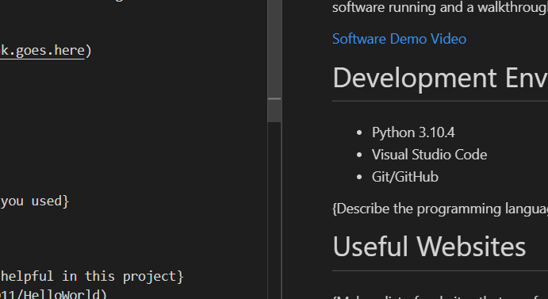

# Overview

This is the classic Hello World!

The purpose was to demonstrate my developement environment with Python, Visual Studio Code, and Git/GitHub.

[Software Demo Video](https://youtu.be/01_4i0tipHI)

# Development Environment

* Python 3.10.4
* Visual Studio Code
* Git/GitHub

# Useful Websites

* [Git](https://github.com/Nightkiller0011/HelloWorld)

